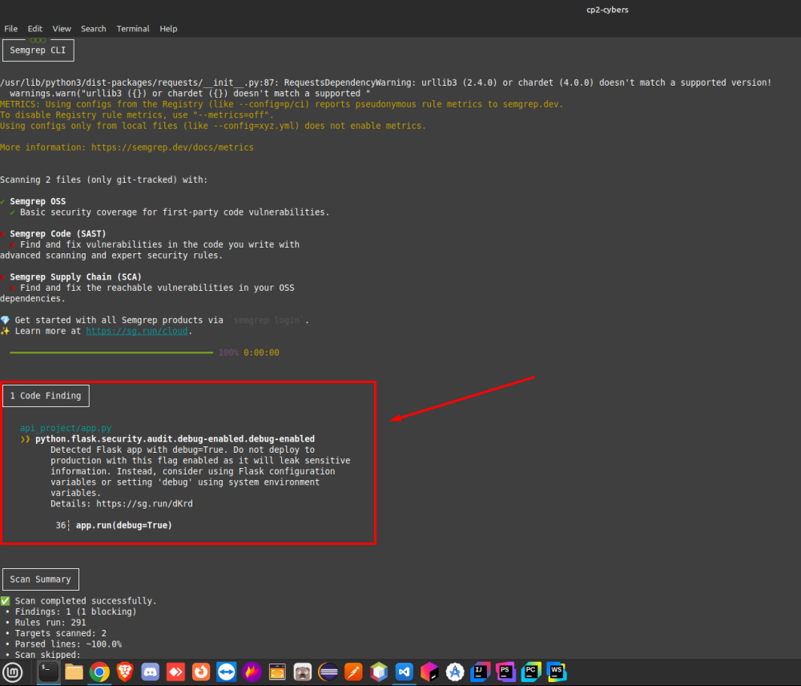
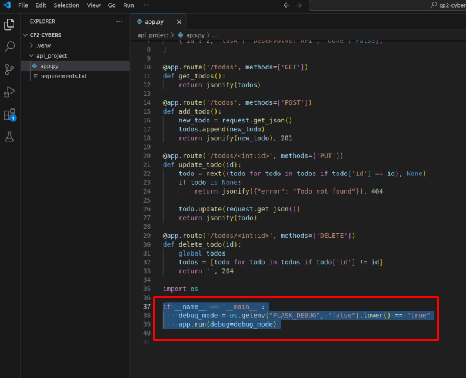
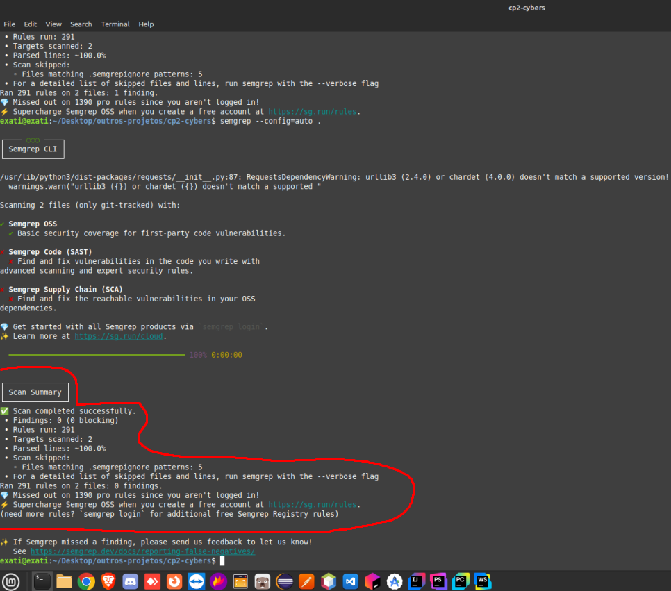

## 🛡️ **Relatório de Análise de Segurança Estática – Cybersecurity (CP2)**

### 📌 **1. Introdução**

Este relatório apresenta o desenvolvimento de uma API RESTful básica utilizando o framework Flask, com o objetivo de aplicar uma análise de segurança estática utilizando a ferramenta **Semgrep**. A atividade faz parte do projeto prático da disciplina de Cyber Security.

---

### 💻 **2. Descrição do Projeto**

O projeto consiste em uma API simples de gerenciamento de tarefas ("todos"), com as seguintes funcionalidades:

* Listar tarefas (`GET /todos`)
* Adicionar uma nova tarefa (`POST /todos`)
* Atualizar uma tarefa existente (`PUT /todos/<id>`)
* Excluir uma tarefa (`DELETE /todos/<id>`)

#### **Tecnologias utilizadas**:

* **Linguagem**: Python 3
* **Framework**: Flask
* **Ferramenta de análise estática**: Semgrep

O código foi desenvolvido com foco em clareza e simplicidade, sendo ideal para aplicação prática dos conceitos de segurança.

---

### 🔍 **3. Ferramenta de Análise Estática Utilizada**

Utilizou-se a ferramenta **[Semgrep](https://semgrep.dev)**, amplamente adotada para análise de segurança estática em projetos Python. A execução foi realizada com o comando:

```bash
semgrep --config=auto .
```

Esse comando verifica o projeto com um conjunto de regras básicas de segurança fornecidas pela Semgrep OSS.

---

### 🧪 **4. Resultados da Análise**

#### 📸 *Print 1 – Alerta detectado pela ferramenta Semgrep:*



#### ⚠️ **Alerta identificado**:

* **Regra**: `python.flask.security.audit.debug-enabled.debug-enabled`
* **Descrição**: O Flask estava sendo executado com `debug=True`, o que pode expor informações sensíveis em produção.
* **Gravidade**: Alta (vazamento de informações, possibilidade de execução de código).

---

### 🛠️ **5. Correção Aplicada**

O código foi ajustado para que o modo debug seja controlado por uma variável de ambiente, evitando riscos em ambientes de produção.

#### 📸 *Print 2 – Código corrigido:*



```py
if __name__ == '__main__':
    app.run(debug=True)
```
Corrigido para:

```py
import os

if __name__ == '__main__':
    debug_mode = os.getenv("FLASK_DEBUG", "false").lower() == "true"
    app.run(debug=debug_mode)
```

#### 📸 *Print 3 – Nova análise Semgrep (sem alertas):*

 

Após a correção, a ferramenta Semgrep foi executada novamente e **nenhum alerta adicional foi identificado**.

---

### ✅ **6. Conclusão**

A análise de segurança estática com Semgrep mostrou-se eficaz na identificação de práticas inseguras, como a execução do Flask em modo de depuração. A atividade permitiu aplicar conceitos fundamentais de segurança no desenvolvimento de APIs, reforçando a importância de revisar o código com ferramentas automatizadas mesmo em projetos simples.

O grupo conclui que a análise estática é uma etapa fundamental no ciclo de desenvolvimento seguro, e que pequenas alterações podem prevenir vulnerabilidades críticas.


- Rafael - RM93092
- Octávio - RM97894
- Sabrina - RM550781
